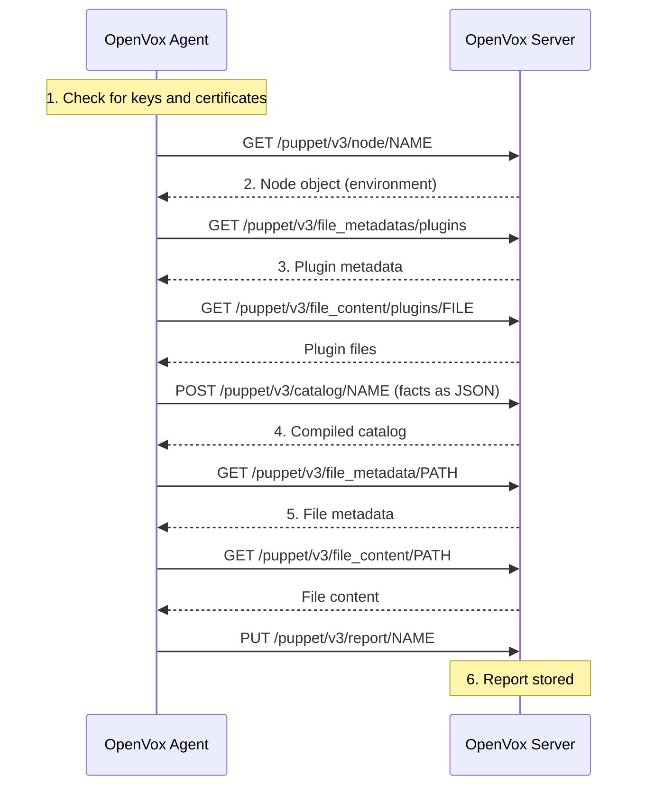

[http_api]: http_api/http_api_index.html
[authconf]: config_file_auth.html
[facts]: lang_variables.html#facts-and-built-in-variables
[catalog]: lang_summary.html#compilation-and-catalogs
[file]: type.html#file
[static]: indirection.html#catalog
[keepalive_setting]: configuration.html#http_keepalive_timeout

OpenVox agent and OpenVox Server communicate via mutually authenticated HTTPS using client
certificates.

The available HTTPS endpoints are detailed in the [HTTP API reference][http_api]. Access to each
endpoint is controlled by [auth.conf][authconf] settings.

## Persistent HTTP and HTTPS connections and Keep-Alive

When acting as an HTTPS client, OpenVox reuses connections by sending `Connection: Keep-Alive`
in HTTP requests. This reduces transport layer security (TLS) overhead, improving performance
for runs with dozens of HTTPS requests.

You can configure the Keep-Alive duration using the [`http_keepalive_timeout`
setting][keepalive_setting], but it must be shorter than the maximum keepalive allowed by the
OpenVox Server web server.

OpenVox caches HTTP connections and verified HTTPS connections. If you specify a custom HTTP
connection class, OpenVox does not cache the connection.

OpenVox always requests that a connection be kept open, but the server can choose to close the
connection by sending `Connection: close` in the HTTP response. If that occurs, OpenVox does not
cache the connection and starts a new connection for its next request.

## Diagram

This sequence diagram illustrates the HTTPS requests an OpenVox agent makes to the OpenVox Server
during a single agent run. See the sections below for a detailed description of each step.

## The process of Agent-side checks and HTTPS requests during a single agent run

1. **Check for keys and certificates:**

   a. The agent downloads the CA (Certification Authority) bundle.

   b. If certificate revocation is enabled, the agent loads or downloads the Certificate
      Revocation List (CRL) bundle using the previous CA bundle to verify the connection.

   c. The agent loads or generates a private key. If the agent needs a certificate, it generates
      a Certificate Signing Request (CSR), including any `dns_alt_names` and `csr_attributes`,
      and submits the request using `PUT /puppet-ca/v1/certificate_request/:certname`.

   d. The agent attempts to download the signed certificate using
      `GET /puppet-ca/v1/certificate/:certname`.

      * If there is a conflict that must be resolved on the OpenVox Server, such as cleaning the
        old CSR or certificate, the agent sleeps for `waitforcert` seconds, or exits with `1` if
        waiting is not allowed, such as when running `puppet agent -t`.

        > **Tip:** This can happen if the agent's SSL directory is deleted, as the OpenVox Server
        > still has the valid, unrevoked certificate.

      * If the downloaded certificate fails verification — for example, if it does not match its
        private key — OpenVox discards the certificate. The agent sleeps for `waitforcert`
        seconds, or exits with `1` if waiting is not allowed, such as when running
        `puppet agent -t`.

2. **Request a node object and switch environments:**

   Do a GET request to `/puppet/v3/node/<NAME>`.

   * If the request is successful, read the environment from the node object. If the node object
     has an environment, use that environment instead of the one in the agent's config file in all
     subsequent requests during this run.
   * If the request is unsuccessful, or if the node object had no environment set, use the
     environment from the agent's config file.

3. **If `pluginsync` is enabled on the agent, fetch plugins** from a file server mountpoint that
   scans the `lib` directory of every module:

   * Do a GET request to `/puppet/v3/file_metadatas/plugins` with `recurse=true` and
     `links=manage`.
   * Check whether any of the discovered plugins need to be downloaded. If so, do a GET request
     to `/puppet/v3/file_content/plugins/<FILE>` for each one.

4. **Request catalog while submitting facts:**

   Do a POST request to `/puppet/v3/catalog/<NAME>`, where the post data is all of the node's
   [facts][] encoded as JSON. Receive a compiled [catalog][] in return.

   > **Note:** Submitting facts isn't logically bound to requesting a catalog. For more
   > information about facts, see [Language: Facts and built-in variables][facts].

5. **Make file source requests while applying the catalog:**

   [File][] resources can specify file contents as either a `content` or `source` attribute.
   Content attributes go into the catalog, and the agent needs no additional data. Source
   attributes put only references into the catalog and might require additional HTTPS requests.

   * If you are using the normal compiler, then for each file source, the agent makes a GET
     request to `/puppet/v3/file_metadata/<SOMETHING>` and compares the metadata to the state
     of the file on disk.
     * If it is in sync, it continues on to the next file source.
     * If it is out of sync, it does a GET request to `/puppet/v3/file_content/<SOMETHING>` for
       the content.
   * If you are using the [static compiler][static], all file metadata is embedded in the
     catalog. For each file source, the agent compares the embedded metadata to the state of the
     file on disk.
     * If it is in sync, it continues on to the next file source.
     * If it is out of sync, it does a GET request to
       `/puppet/v3/file_bucket_file/md5/<CHECKSUM>` for the current content.

   The static compiler is cheaper in terms of network traffic, but potentially more expensive
   during catalog compilation. Large amounts of files, especially recursive directories, amplify
   the effect in both directions.

6. **Submit report:**

   If `report` is enabled on the agent, do a PUT request to `/puppet/v3/report/<NAME>`. The
   content of the PUT should be a Puppet report object in YAML format.
